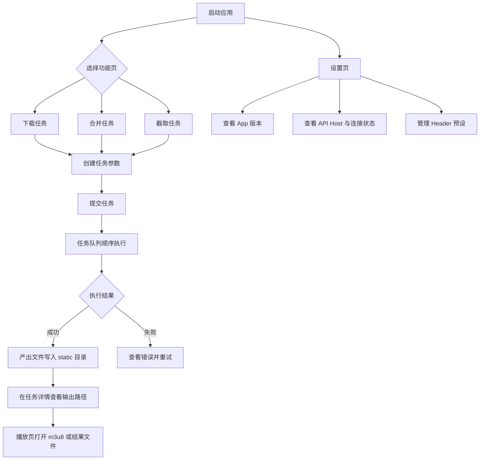

# media-tool-rs

一个处理媒体的常用工具


## 可视化界面

项目包含一个 React + Material UI 前端，目录在 `desktop/`。

### 1. 启动后端接口

在项目根目录执行：

```bash
cargo run -- serve --port=0
```

这会启动可视化界面所需的任务接口，支持：

- 新建下载、合并、截取任务
- 查询任务状态和最终输出路径
- 顺序执行任务，避免下载时目录切换冲突
- 自动托管 `./static` 目录，可直接访问 `http://127.0.0.1:8080/static/download/<folder>/<file>.mp4`
- Header 预设配置文件保存在 `config/header_presets.json`

### 2. 启动 React 前端

```bash
cd desktop
npm install
npm run dev:with-server
# 或者使用 npm run tauri dev
```

默认开发地址是 `http://127.0.0.1:5173`，Vite 会把 `/api` 与 `/static` 代理到后端实际启动地址。

> 推荐使用 `npm run dev:with-server`，它会自动：
>
> - 启动后端 `cargo run -- serve --port 0`（随机空闲端口）
> - 读取后端实际端口
> - 注入给 Vite 代理（`/api` 与 `/static`）
> - 如 5173 被占用，浏览器开发会自动切换到下一个可用端口
>
> 如需调整后端地址检测超时（默认 120 秒），可这样启动：
>
> ```bash
> MEDIA_TOOL_DETECT_TIMEOUT_MS=180000 npm run dev:with-server
> ```

如果使用 `npm run tauri dev`：

- 请确保在 `desktop` 目录执行命令；
- 已自动执行 `npm run dev:with-server:tauri`，固定使用 5173 以匹配 Tauri `devUrl`；
- 首次运行会编译 `desktop/src-tauri`（已初始化）；
- Linux 需要先安装 GTK/WebKit 相关系统依赖（例如 `glib-2.0`、`webkit2gtk`、`libsoup3` 等），否则会出现 `glib-2.0.pc not found` 之类报错。

### 2.1 打包后（tauri build）说明

- 应用启动时会在后台自动启动本地 API 服务（随机空闲端口）
- 运行时会将地址写入：`~/Library/Application Support/com.wj.mediatoolrs/config/runtime/server-info.json`
- 前端会在 Tauri 运行时自动读取该地址，无需依赖 Vite 代理
- 在应用「设置」页面可查看当前 API Host 与连接状态

### 3. 前端能力

- 可视化创建 `download` / `combine` / `cut` 任务
- 实时查看任务状态、命令预览和输出结果
- 支持在线播放 m3u8 链接
- 适合在 macOS、Windows 上运行

### 4. 应用操作说明

1. 打开应用后先进入「下载 / 合并 / 截取」页面创建任务。
2. 任务创建后可在列表中查看状态，支持刷新、重试、删除、查看详情。
3. 下载任务完成后可一键播放；合并/截取结果支持通过内置播放页打开。
4. 在「设置」页面可管理 Header 预设，并查看当前 API Host、连接信息和 App 版本。

### 4.1 应用操作流程图



### 5. 当前版本变更

当前版本：`1.0.0`

- 新增桌面端内置 API 自动启动与动态端口发现。
- 设置页支持显示当前 API Host 与连接状态。
- 设置页新增显示 App 版本（读取 Tauri 配置版本）。
- 导航调整：设置页面放到菜单最后。
- 应用产品名更新为 **Media Tool**。
- 更新桌面应用图标资源。

### 6. GitHub Actions 自动打包桌面应用

新增工作流：`.github/workflows/desktop-build.yml`

- 触发条件：
	- 手动触发（`workflow_dispatch`）
	- 推送到 `main` 且命中桌面相关路径改动
- 打包平台：macOS / Linux / Windows
- 输出产物：作为 GitHub Actions Artifacts 上传（对应各平台 bundle）

### 7. GitHub Actions Tag 自动发布 Release

新增工作流：`.github/workflows/desktop-release.yml`

- 触发条件：
	- 推送 tag（例如 `v1.0.1`）
	- 手动触发（`workflow_dispatch`）
- 执行内容：
	- 跨平台构建 Tauri 桌面包（macOS / Linux / Windows）
	- 自动创建/更新对应 GitHub Release 并上传安装包
